Oxygen Diagenesis
================
Karline Soetaert and Arthur Capet
4 mei 2017

Set-up
======

We start with a simple oxygen diagenetic model. We need

### 1. to load librairies R-package ReacTran.

``` r
require(ReacTran, quietly = TRUE) # transport models in aquatic systems 
require(marelac, quietly = TRUE)  # toolbox for aquatic sciences
```

    ## 
    ## Attaching package: 'marelac'

    ## The following objects are masked from 'package:oce':
    ## 
    ##     coriolis, gravity

### 2. to set a spatial framework

Here, a vertical 1D grid with a 100 levels over 10cm.

``` r
grid <- setup.grid.1D(N = 100, L = 10)
```

### 3. Model equations

We consider **diffusion** and constant **respiration** above a certain depth.
$$\\frac{\\partial O\_2(z)}{\\partial t}=\\frac{\\partial O\_2(z)}{\\partial t}|\_{trasnport}-\\gamma(z)$$

*O*<sub>2</sub> is a concentration in *m**m**o**l* *m*<sub>*l**i**q**u**i**d*</sub><sup>−3</sup> and we have to consider porosity *ϕ*.
$$ \\frac{\\partial O\_2(z)}{\\partial t} =  \\frac{1}{\\phi}\\frac{\\partial}{\\partial z}\[\\phi D \\frac{\\partial C}{\\partial z }\]  - \\gamma (z) $$
 Boundary conditons are imposed as:

-   constant concentration at the sediment-water interface
    *O*<sub>2</sub>(*z* = 0)=*O*<sub>2, *b**o**t**t**o**m*</sub>
-   nul gradient at the lower cell
    $$ \\frac{\\partial O\_2}{\\partial z}|\_{(z=sediment~bottom)}=0$$

``` r
O2model <- function (t, O2, p) {
  with (as.list(p), {
    # Transport term (using ReacTran routines)
    O2tran <- tran.1D(C = O2, C.up = O2BW, D = D, VF = porosity, dx = grid)
    # Respiration
    O2cons <- minrate*(grid$x.mid < mindepth)    
    # the function returns the time derivative
    list(O2tran$dC - O2cons, O2cons = O2cons)
  })
}
```

### 4. to assign a value to the model parameters

``` r
parms <- c(
  porosity = 0.8    , # -
  minrate  = 1    , # nmol O2/cm3/d - oxygen consumption rate
  mindepth = 5    , # cm            - depth below which minrate = 0
  O2BW     = 300  , # nmol/cm3       - bottom water oxygen concentration
  D        = 1      # cm2/d         - molecular diffusion coefficient
)
```

Simulation
==========

Let us now compute the steady state solutions for three set of parameters (multiplying the respiration rate) and plot the ouputs.

``` r
parms2 <- parms3 <- parms
parms2["minrate"] <- 2
parms3["minrate"] <- 4

# random initial conditions
IC<-runif(length(grid$x.mid))

# computes the steay-state solution
out  <- steady.1D(y = IC, parms = parms, func = O2model, nspec = 1, names = "O2")
out2 <- steady.1D(y = IC, parms = parms2, func = O2model, nspec = 1, names = "O2")
out3 <- steady.1D(y = IC, parms = parms3, func = O2model, nspec = 1, names = "O2")

plot(out, out2, out3, xyswap = TRUE, xlab = "mmol/m3", ylab = "cm", grid = grid$x.mid)
```

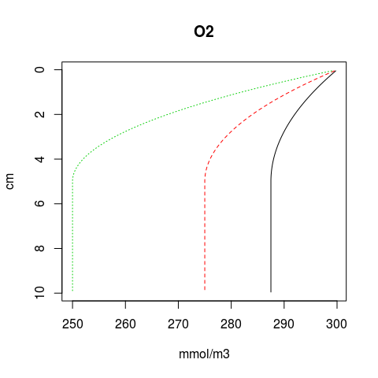

<table style="width:26%;">
<colgroup>
<col width="26%" />
</colgroup>
<tbody>
<tr class="odd">
<td align="left"># Specific Outputs So far the variable ´out´ contains the steady-state solution and the diagnostic ´O2cons´</td>
</tr>
<tr class="even">
<td align="left"><code>r str(out)</code></td>
</tr>
<tr class="odd">
<td align="left"><code>## List of 2 ##  $ y     : num [1:100, 1] 300 299 299 298 298 ... ##   ..- attr(*, &quot;dimnames&quot;)=List of 2 ##   .. ..$ : NULL ##   .. ..$ : chr &quot;O2&quot; ##  $ O2cons: num [1:100] 1 1 1 1 1 1 1 1 1 1 ... ##  - attr(*, &quot;precis&quot;)= num [1:3] 6.57e+02 5.10e-03 4.93e-09 ##  - attr(*, &quot;steady&quot;)= logi TRUE ##  - attr(*, &quot;class&quot;)= chr [1:3] &quot;steady1D&quot; &quot;rootSolve&quot; &quot;list&quot; ##  - attr(*, &quot;dimens&quot;)= num 100 ##  - attr(*, &quot;nspec&quot;)= num 1 ##  - attr(*, &quot;ynames&quot;)= chr &quot;O2&quot;</code> The model declaration is modified to add a diagnostic : the oxygen flux at the sediment-water interface ´O2flux´.</td>
</tr>
<tr class="even">
<td align="left"><code>r O2model &lt;- function (t, O2, p) { with (as.list(p), { O2tran &lt;- tran.1D(C = O2, C.up = O2BW, D = D, VF = porosity, dx = grid) O2cons &lt;- minrate*(grid$x.mid &lt; mindepth) list(O2tran$dC - O2cons, O2cons = O2cons,O2flux=O2tran$flux.up) }) }</code></td>
</tr>
<tr class="odd">
<td align="left">```r out &lt;- steady.1D(y = IC, parms = parms, func = O2model, nspec = 1, names = &quot;O2&quot;) out2 &lt;- steady.1D(y = IC, parms = parms2, func = O2model, nspec = 1, names = &quot;O2&quot;) out3 &lt;- steady.1D(y = IC, parms = parms3, func = O2model, nspec = 1, names = &quot;O2&quot;)</td>
</tr>
<tr class="even">
<td align="left">plot(x = c(parms[&quot;minrate&quot;] , parms2[&quot;minrate&quot;] , parms3[&quot;minrate&quot;]), y = c(out<span class="math inline"><em>O</em>2<em>f</em><em>l</em><em>u</em><em>x</em>, <em>o</em><em>u</em><em>t</em>2</span>O2flux, out3$O2flux), xlab=&quot;Mineralization rate - [nmol O2/cm3/d]&quot; , ylab=&quot;Oxygen Flux @ SWI - [nmol/cm2/d]&quot;) ```</td>
</tr>
<tr class="odd">
<td align="left">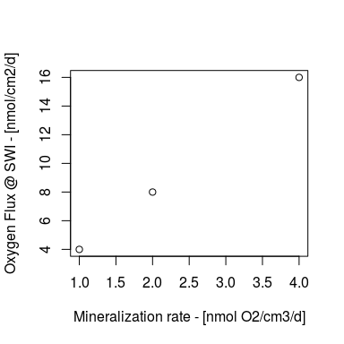 At steady-state, the flux at the interface equals the total amount of oxygen consumed in the sediment. Here, consumption takes place only in the liquid, so we have to consider porosity in the integral. <br /><span class="math display">$$ \int\limits_\infty^0 \mathbf{\phi} \gamma  ~ dz =\phi  \gamma_0 L $$</span><br /></td>
</tr>
</tbody>
</table>

SensRange
=========

The library FME is a toolbox for exploring model characteristics.

``` r
library(FME)
```

    ## Loading required package: coda

We will only use the function sensRange, that allows to visualize the variability of model outputs when a parameter is allowed to vary within a given range.

´sensRange´ needs

-   a data frame to precise which parameter should vary and within which range.

``` r
parRange <- data.frame(min=1,max=10)
rownames(parRange)<-"minrate"
```

-   A function that reecievs a set of parameter and returns the response variable to be investigated (here we define two functions, for ´O2´ and ´O2flux´)

``` r
solveO2<-function(pars){
  out  <- steady.1D(y = IC, parms = pars, func = O2model, nspec = 1, names = "O2")
  return(data.frame(Depth=grid$x.mid , O2=out$y))
}

solveO2f<-function(pars){
  out  <- steady.1D(y = IC, parms = pars, func = O2model, nspec = 1, names = "O2")
  return(data.frame(Depth=0,O2flux=out$O2flux))
}


sR<-sensRange(func = solveO2, sensvar = "O2", parms=parms, 
              parRange = parRange, num=50, dist='grid')

sRf<-sensRange(func = solveO2f, sensvar = "O2flux", parms=parms,
               parRange = parRange, num=50, dist='grid')

plot(summary(sR),xyswap = TRUE, xlab = "nmol/cm3", ylab = "cm")
plot(summary(sRf), xlab = "nmol/cm2/d",  main="O2 flux")
```

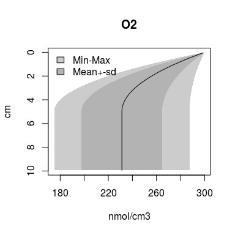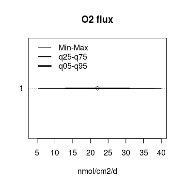

Exercices
=========

1. Explore the range of model response to variations of other parameters
========================================================================

*Hint* : Just adapt parRange in the upper code.

2. Read measured data (Flux and/or Profiles), include them to the plot
======================================================================

*Hint* : use read.table to read the data. Add them to the previous plot using ´line´ and ´points´

Example:

``` r
measuredO2flux = 20

O2prof<-matrix(ncol=2,  data=c(0.5,1,2,3,4,285,280,270,260,255))
colnames(O2prof)<-c("depth","O2")

plot(summary(sRf), xlab = "nmol/cm2/d", main="O2 flux")
points(x= 25,y=1, col="red", cex=5 )

plot(summary(sR),xyswap = TRUE, xlab = "nmol/cm3", ylab = "cm")
lines(y=O2prof[,'depth'] ,x=O2prof[,'O2'], col="red" )
```

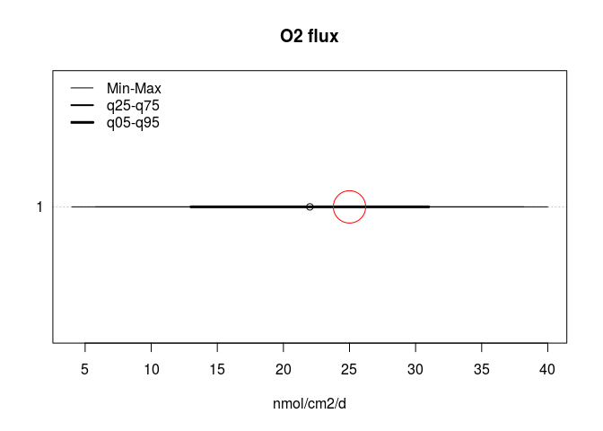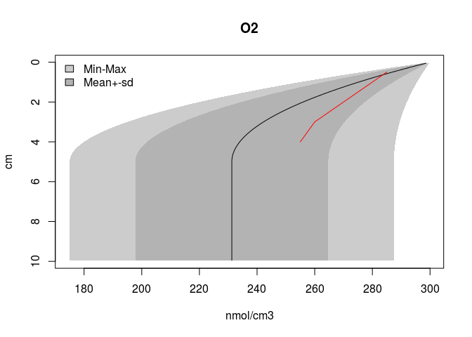 Can you try parameters value that match your measurements ?

``` r
plot(out, xyswap = TRUE, xlab = "mmol/m3", ylab = "cm", grid = grid$x.mid)
lines(y=c(0.5,1,2,3,4) ,x=c(295,280,270,260,255), col="red" )

barplot( height = c(out$O2flux, measuredO2flux ), ylab="Oxygen Flux @ SWI - [nmol/cm2/d]", names.arg = c("Model","Measured"),col=c('black','red'))
```

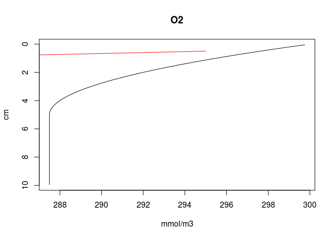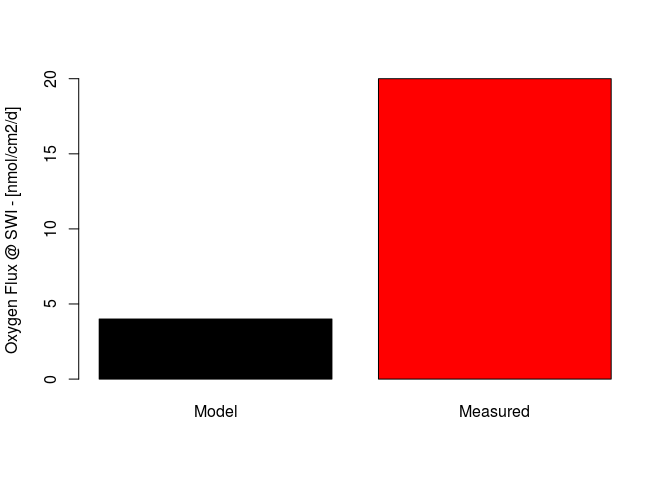

Same with the other parameters, also testing different distributions

\`\`\`r library(FME)

parRange &lt;- data.frame(min= c( .5 , 1 , 1 , 200 , .1 ), max= c( 1 , 10 , 10 , 400 , 10 )) rownames(parRange)&lt;-names(parms) \`\`\`

|          |    min|  max|
|----------|------:|----:|
| porosity |    0.5|    1|
| minrate  |    1.0|   10|
| mindepth |    1.0|   10|
| O2BW     |  200.0|  400|
| D        |    0.1|   10|

``` r
par(mfrow=c(2,2))

parRangelocal<-parRange[1,]

sR<-sensRange(func = solveO2, sensvar = "O2", parms=parms, parRange = parRangelocal,
              num=100, dist='grid')
sRf <- sensRange(func = solveO2f, sensvar = "O2flux", parms=parms, parRange = parRangelocal,
              num=100, dist='grid')
plot(summary(sR),xyswap = TRUE, xlab = "mmol/m3", ylab = "cm")
```

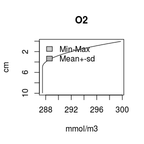

``` r
plot(summary(sRf),xyswap = TRUE, xlab = "nmol/m2/d", ylab = "cm")
```

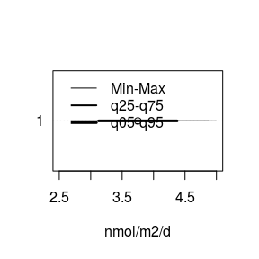

``` r
hist(sR[,1], xlab = rownames(parRangelocal))
```

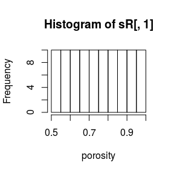

------------------------------------------------------------------------

``` r
parRangelocal<-parRange[2,]

sR<-sensRange(func = solveO2, sensvar = "O2", parms=parms, parRange = parRangelocal,
              num=100, dist='grid')
sRf <- sensRange(func = solveO2f, sensvar = "O2flux", parms=parms, parRange = parRangelocal,
              num=100, dist='grid')
plot(summary(sR),xyswap = TRUE, xlab = "mmol/m3", ylab = "cm")
```

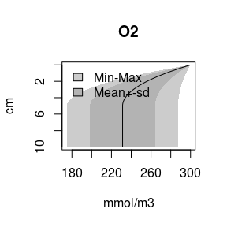

``` r
plot(summary(sRf),xyswap = TRUE, xlab = "nmol/m2/d", ylab = "cm")
```

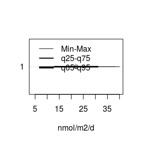

``` r
hist(sR[,1], xlab = rownames(parRangelocal))
```


------------------------------------------------------------------------

``` r
parRangelocal<-parRange[3,]
sR<-sensRange(func = solveO2, sensvar = "O2", parms=parms, parRange = parRangelocal,
              num=100, dist='grid')
sRf <- sensRange(func = solveO2f, sensvar = "O2flux", parms=parms, parRange = parRangelocal,
              num=100, dist='grid')
plot(summary(sR),xyswap = TRUE, xlab = "mmol/m3", ylab = "cm")
```

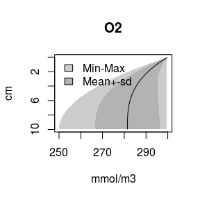

``` r
plot(summary(sRf),xyswap = TRUE, xlab = "nmol/m2/d", ylab = "cm")
```

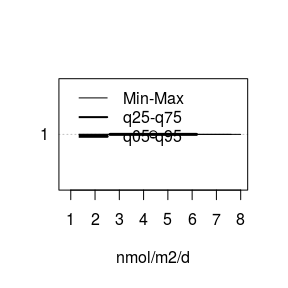

``` r
hist(sR[,1], xlab = rownames(parRangelocal))
```

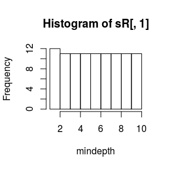

------------------------------------------------------------------------

``` r
parRangelocal<-parRange[4,]

sR<-sensRange(func = solveO2, sensvar = "O2", parms=parms, parRange = parRangelocal,
              num=100, dist='grid')
sRf <- sensRange(func = solveO2f, sensvar = "O2flux", parms=parms, parRange = parRangelocal,
              num=100, dist='grid')
plot(summary(sR),xyswap = TRUE, xlab = "mmol/m3", ylab = "cm")
```

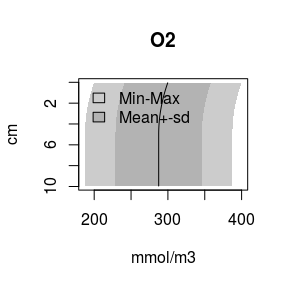

``` r
plot(summary(sRf),xyswap = TRUE, xlab = "nmol/m2/d", ylab = "cm")
```

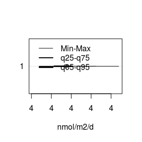

``` r
hist(sR[,1], xlab = rownames(parRangelocal))
```


------------------------------------------------------------------------
